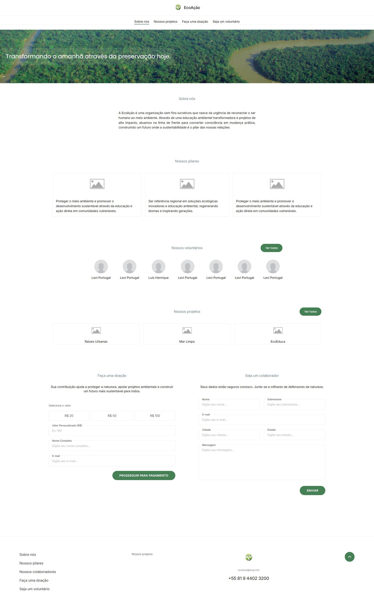
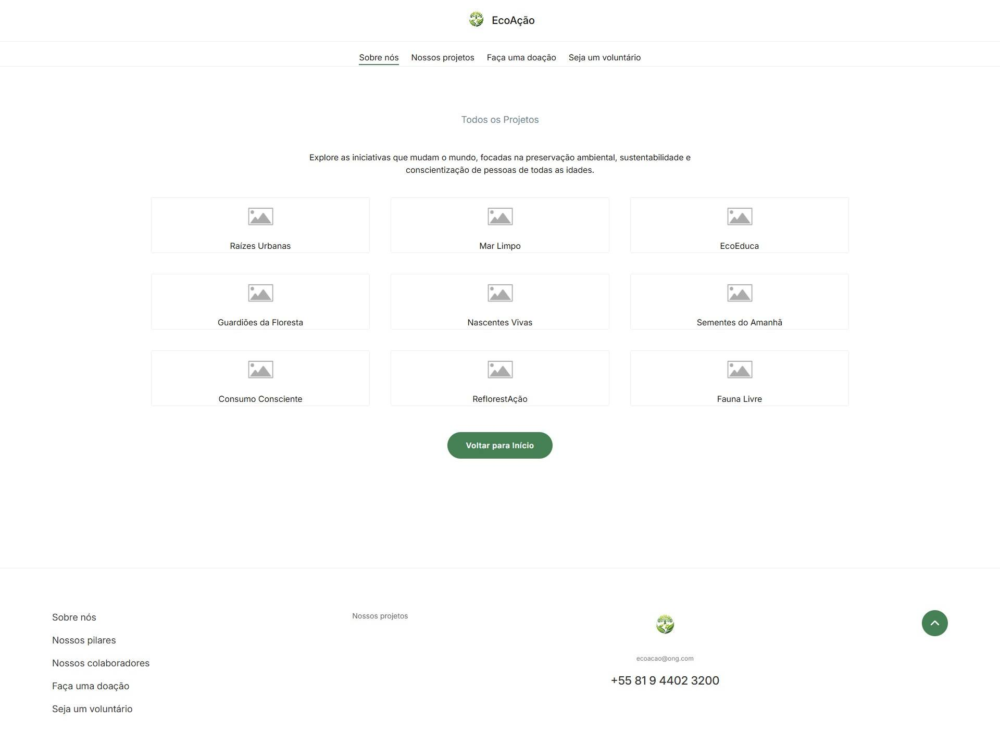
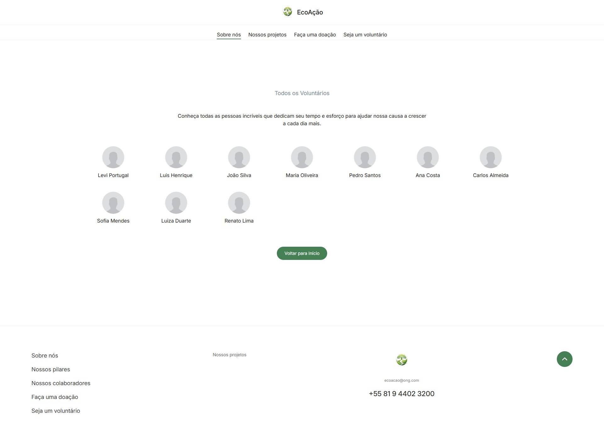

<h1 align="center">
   
  
</h1>

<h4 align="center">EcoAção</h4>

    
    
    

A EcoAção é um site de ONG fictícia feito com HTML, CSS e JavaScript. Ele representa uma organização sem fins lucrativos que busca reconectar o ser humano ao meio ambiente. O site apresenta informações sobre a ONG, seus projetos, os colaboradores, além de mostrar como participar e realizar doações, incentivando ações práticas e sustentáveis.

> _**Nota:** Este projeto é fictício e foi feito apenas para fins de estudo.._

### Tecnologias usadas

  
  
  
  

> _**Nota:** CSS e JavaScript, serão implementadas gradualmente._

### Imagens

  <table>
    <tr>
      <td style="border: none; border-bottom: 1px solid #d0d7de;">
        <em>Página inicial</em>
      </td>
    </tr>
  </table>

  

  <table>
    <tr>
      <td style="border: none; border-bottom: 1px solid #d0d7de;">
        <em>Página de todos os projtos</em>
      </td>
    </tr>
  </table>

  

  <table>
    <tr>
      <td style="border: none; border-bottom: 1px solid #d0d7de;">
        <em>Página de todos os colaboradores</em>
      </td>
    </tr>
  </table>

  

### Colaboradores

  

